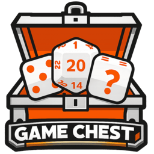

# Game Chest

  

A Dalamud plugin for Final Fantasy XIV that gives Game Masters a suite of roll-based and chat-based mini-games for use in roleplay events.

> **Authors:** Zune, Mangles, Potatoes

---

## Overview

Game Chest hooks into FFXIV's native `/random` and `/dice` roll events and chat messages, then lets the GM orchestrate five distinct mini-games through an ImGui control panel. Players participate naturally — they just roll or type in chat.

---

## Installation

> Requires [FFXIV QuickLauncher](https://github.com/goatcorp/FFXIVQuickLauncher) with Dalamud enabled.

1. Open the Dalamud Plugin Installer (`/xlplugins`).
2. Add the custom repository URL and search for **Game Chest**.
3. Click **Install**.

To open the main window after installing, type `/gamechest` in chat.

---

## Commands

| Command | Description |
|---|---|
| `/gamechest` | Toggle the main window |
| `/gc` | Alias for `/gamechest` (configurable) |
| `/gamechest settings` | Open Settings |
| `/gamechest fight` | Open Fight Club window |
| `/gamechest prizeroll` | Open Prize Roll window |
| `/gamechest deathroll` | Open Death Roll window |
| `/gamechest deathrolltournament` | Open Tournament window |
| `/gamechest wordguess` | Open Word Guess window |

The `/gc` alias can be replaced with a custom command of your choice from the Settings window.

---

## Games

### ⚔️ Fight Club

A 1v2 turn-based HP combat game driven by `/random` rolls.

**How it works:**
1. GM clicks **Begin Registration** — the plugin announces registration in chat.
2. Players join by typing the configured join phrase (default: `I want to fight!`) in the listened channel. The GM can also add players manually from the UI.
3. Once 2 fighters are registered, GM clicks **Start Fight** — each player rolls for initiative.
4. The higher roll goes first. Each turn the attacker rolls:
   - **Roll of 1** → Fumble: attacker loses their next turn, no damage.
   - **Max roll** → Critical Hit: bonus damage added.
   - **Everything else** → Normal attack: roll = damage.
5. The fight ends when a fighter's HP reaches 0.

**Settings:**
- HP and MP per player (1-9999)
- Max roll (2-999, default 20)
- Output chat channel
- Timers: registration reminder, inactivity reminder, out-of-turn cooldown
- Auto Mode (auto-sends announcements with a configurable delay)
- **Presets** — save and load full configuration snapshots by name

---

### 🎲 Prize Roll

An open-roll competition where the winner is the player with the best roll according to the configured sorting mode.

**How it works:**
1. GM clicks **Start** — announces the game is open.
2. Players roll `/random <MaxRoll>`. Each roll is tracked in a live leaderboard.
3. When a new best is set, the plugin announces it.
4. GM clicks **Stop** to close the game and announce the winner.

**Sorting modes:**
- **Highest** — highest roll wins (default)
- **Lowest** — lowest roll wins
- **Nearest** — closest to a target value wins

**Settings:**
- Sorting mode and nearest target value
- Max roll (default 999)
- Reroll: allow players to re-roll with a configurable per-player limit
- Optional auto-stop timer

---

### 💀 Death Roll

A decreasing chain-roll duel between two players. Whoever rolls 1 loses.

**How it works:**
1. GM clicks **Start**.
2. The first player rolls `/random 999` (or the configured starting roll). Their result is the new cap.
3. The second player must roll `/random <previous result>`.
4. Players alternate; the chain decreases until someone rolls 1 — that player loses.
5. The GM can click **New Round** to rematch the same players.

**Settings:**
- Starting roll (default 999)
- Output channel

---

### 🏆 Death Roll Tournament

A full single-elimination bracket tournament built on Death Roll duels.

**How it works:**
1. GM clicks **Begin Registration**.
2. Players register by rolling `/random` (no number). The GM can also add players manually.
3. GM clicks **Close Registration** — players are shuffled and seeded into a power-of-2 bracket. BYE slots are resolved automatically.
4. For each round, GM clicks **Start Match** to begin the Death Roll duel between two players.
5. GM clicks **Advance** after each match — the winner moves forward; BYEs pass automatically.
6. The GM can **Forfeit** a match to a specific player at any time.
7. The last player standing wins the tournament.

**Settings:**
- Starting roll (default 999)
- Output channel

---

### 📝 Word Guess

A chat-based trivia game where the first player to type the correct answer wins the round.

**How it works:**
1. The GM sets up a question list in the **Question List** editor (question, answer, optional hint, optional per-question timer).
2. GM clicks **Start** — the first question is announced in chat.
3. Players type the answer in any listened channel. The first correct match wins.
4. GM clicks **Next** to move to the next question (or it auto-advances if enabled).
5. The game ends when all questions are exhausted.

**Victory modes:**
- **Single** — each round is independent; no session tracking.
- **Session** — scores are tracked across all rounds; a session champion is announced at the end.

**Settings:**
- Partial match: accept answers that contain (rather than exactly match) the answer
- Case-sensitive matching
- Auto-Advance: automatically move to the next question on win or timeout
- Hint reveal: optionally send a hint after a configurable delay (default 30s)
- Global timer: set a per-round time limit (default 60s)
- Per-question timer override in the question list

---

## Features

### Phrase System
Every game has a phrase editor accessible from the main window toolbar. Each game has categories (e.g. *Registration Open*, *Fight Start*, *New Best Roll*) with built-in defaults. You can:
- Add your own custom phrases per category with adjustable weight.
- Toggle categories on or off.
- Preview rendered output with live template substitution.

Template variables like `{player}`, `{damage}`, `{health}`, `{roll}`, and others are replaced at announcement time.

### Blocklist
A global blocklist prevents specific players from participating in any game. Manage it from the **Blocklist** button in the main toolbar.

### Debug Mode
Enable **Debug Mode** in Settings to show **Simulate Roll** and **Simulate Answer** buttons on all game windows. This lets you test games solo without needing other players.

### Presets (Fight Club)
Fight Club supports named configuration presets — save your current setup and restore it with one click. Great for running events with different rules.

### Match History
All games keep the last 10 match results in memory for reference during a session.

---

## Configuration

Open Settings via `/gamechest settings` or the cog icon in the main window.

| Setting | Description |
|---|---|
| **Listen to Rolls** | Enable the `/random` and `/dice` roll hook |
| **Listen to Chat** | Enable chat message processing (required for Fight Club joins and Word Guess) |
| **Listened Channels** | Which chat channels to monitor (default: Say) |
| **Blocklist Active** | Whether to enforce the global blocklist |
| **Highlight Color** | Accent color used throughout all game windows |
| **Custom Command** | Replace the default `/gc` alias with your own command |
| **Open on Startup / Login** | Auto-open the main window on plugin load or character login |
| **Debug Mode** | Show simulation buttons on all game windows |

---
